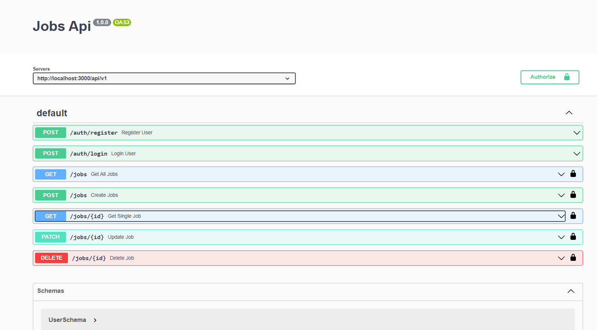
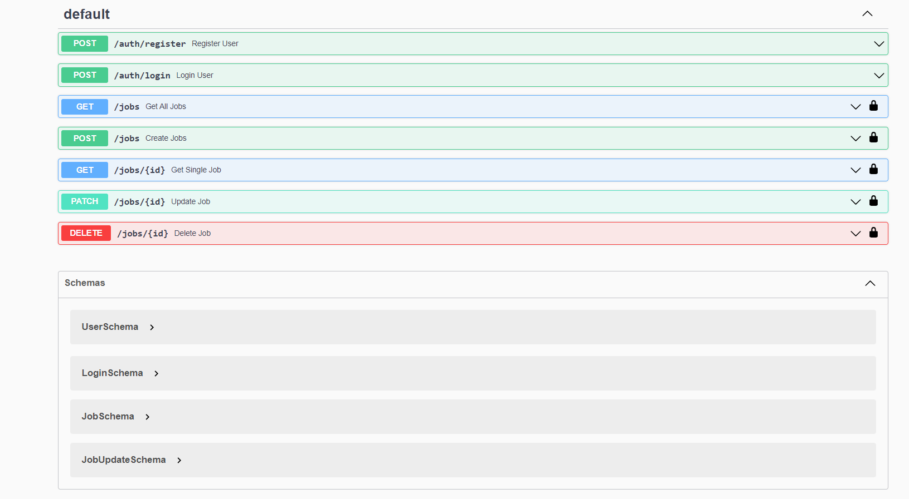

#### Setup

```bash
npm install && npm start
```

#### Database Connection

1. Import connect.js
2. Invoke in start()
3. Setup .env in the root
4. Add MONGO_URI with correct value

#### Routers

- auth.js
- jobs.js

#### User Model

Email Validation Regex

```regex
/^(([^<>()[\]\\.,;:\s@"]+(\.[^<>()[\]\\.,;:\s@"]+)*)|(".+"))@((\[[0-9]{1,3}\.[0-9]{1,3}\.[0-9]{1,3}\.[0-9]{1,3}\])|(([a-zA-Z\-0-9]+\.)+[a-zA-Z]{2,}))$/
```

#### Register User

- Validate - name, email, password - with Mongoose
- Hash Password (with bcryptjs)
- Save User
- Generate Token
- Send Response with Token

#### Login User

- Validate - email, password - in controller
- If email or password is missing, throw BadRequestError
- Find User
- Compare Passwords
- If no user or password does not match, throw UnauthenticatedError
- If correct, generate Token
- Send Response with Token

#### Mongoose Errors

- Validation Errors
- Duplicate (Email)
- Cast Error

#### Security

- helmet
- cors
- xss-clean
- express-rate-limit

Swagger UI

```yaml
/jobs/{id}:
  parameters:
    - in: path
      name: id
      schema:
        type: string
      required: true
      description: the job id
```
#### How to maneuver Swagger Locally

-Export  postman collection
- Use `metamug.com` to convert the postman collection to swagger
- Copy the swagger code and paste it in Swagger then export it as a JSON file
- Create a json file and name it `openapi.json`


- Run the application
- Open the browser and navigate to `http://localhost:3000/api-docs`
- You should see the Swagger UI



